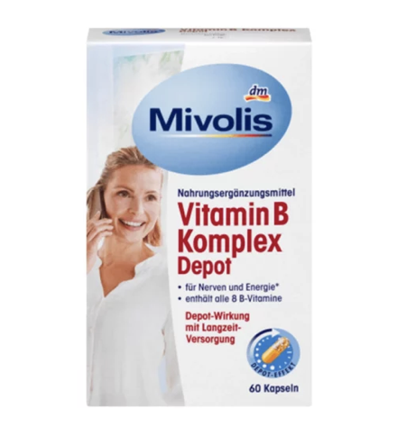

# ✨ German Brands eCommerce Platform ✨
## 🇩🇪 *Where Authentic German Beauty Meets Digital Innovation* 🇩🇪

*🎯 Capstone Project for Vibe Coding Course*

---

## 🚀 **The Vision**

> *"Imagine walking into the finest German apothecary, but it's in your pocket, available 24/7, and delivers worldwide. That's German Brands."*

  <h3 style="margin: 0; font-size: 24px;">🎨 Creative Concept</h3>
  
"Bringing the precision, quality, and trust of German craftsmanship to the digital world of beauty commerce."

### 📌 Project Overview

**German Brands** is a full-stack eCommerce web application that showcases and sells premium beauty and cosmetics products **exclusively made in Germany**. The platform allows customers to discover trusted German brands (e.g., Dr. Hauschka, Weleda, Lavera, Nivea, and niche organic labels) in one curated online store. Built with **Django (backend)** and **React (frontend)**, it offers secure browsing, personalized recommendations, and seamless checkout. This project serves as my graduation capstone for the Vibe Coding course, demonstrating end-to-end development of a modern, scalable online shop.

---

## 👥 **Meet Our Community**

  <h4 style="margin: 0 0 10px; color: #333;">🌍 Sarah, 28 - International Shopper</h4>
  
"I've heard amazing things about German skincare but can't find authentic products in my country. I need a trusted source!"

  
📠Lives in: New York | 💰 Budget: $50-100/month

  <h4 style="margin: 0 0 10px; color: #333;">🌱 Emma, 32 - Eco-Conscious Buyer</h4>
  
"I only use natural, cruelty-free products. German brands are known for their organic standards!"

  
📠Lives in: London | 💰 Budget: $80-150/month

  <h4 style="margin: 0 0 10px; color: #333;">🇩🇪 Klaus, 35 - German Expat</h4>
  
"I miss the quality German products from home. Need reliable shipping to Canada!"

  
📠Lives in: Toronto | 💰 Budget: $60-120/month

  <h4 style="margin: 0 0 10px; color: #333;">👨‍💼 Michael - Store Manager</h4>
  
"I need to showcase new German arrivals and manage inventory efficiently."

  
📠Works in: Munich | 💰 Focus: Operations

---

## 🏆 **Brand Showcase - Authentic German Heritage**

  

    
    

      <h3 style="margin: 0; font-size: 28px; font-weight: 700;">German Brands</h3>
      
Premium Beauty & Cosmetics

      

        🇩🇪 Made in Germany
        🌿 Organic Certified
        🌠Global Shipping
      

    

  

## 🧩 **Feature Showcase - The German Brands Experience**

  
🇩🇪

  <h4 style="margin: 0 0 10px; font-size: 18px;">Authentic German Catalog</h4>
  
Every product verified "Made in Germany" with certification badges

  

    ✨ BDIH • NATRUE • Organic Certified
  

  
🛒

  <h4 style="margin: 0 0 10px; font-size: 18px;">Smart Shopping</h4>
  
AI-powered recommendations and wishlist management

  

    🎯 Personalized • 💝 Wishlist • 🔄 Re-order
  

  
🌍

  <h4 style="margin: 0 0 10px; font-size: 18px;">Global Reach</h4>
  
Worldwide shipping with multilingual support

  

    🇬🇧 English • 🇩🇪 Deutsch • 💶 EUR Pricing
  

  
🔒

  <h4 style="margin: 0 0 10px; font-size: 18px;">Secure & Compliant</h4>
  
GDPR-compliant with secure payment processing

  

    🛡️ GDPR • 💳 PCI DSS • 🔐 JWT Auth
  

  
📊

  <h4 style="margin: 0 0 10px; font-size: 18px;">Admin Dashboard</h4>
  
Comprehensive management with analytics

  

    📈 Analytics • 📦 Inventory • 👥 Customer Support
  

  
⚡

  <h4 style="margin: 0 0 10px; font-size: 18px;">Performance First</h4>
  
Lightning-fast with modern tech stack

  

    ⚡ React • 🐍 Django • 🚀 CDN • 📱 Mobile-First
  

  <h3 style="margin: 0 0 10px; font-size: 24px;">🎯 Key Differentiators</h3>
  

    🇩🇪 100% German Products
    🌿 Organic Certified
    🌠Global Shipping
    🔒 GDPR Compliant
    ⚡ Modern Tech Stack
  

---

## 🔁 **The Customer Journey Adventure**

*Follow Sarah's journey as she discovers authentic German beauty products!*

  <h4 style="margin: 0;">🎯 Journey Insights</h4>
  
Sarah's highest satisfaction comes from authentic German branding and smooth checkout experience!

---

## 🎨 **Design Philosophy & Interactive Elements**

  <h3 style="margin: 0; font-size: 24px;">🎯 Design Principles</h3>
  
"German precision meets digital creativity - where every pixel serves a purpose."

### **Interactive Product Showcase**

*Hover over the product cards to see the magic!*

<!-- Product Card 1 -->

  

    
    
      🇩🇪 Made in Germany
    
  

  <h3 style="margin: 0 0 8px; font-size: 18px; font-weight: 700; color: #1e293b;">Weleda Skin Food</h3>
  
Rich organic moisturizer • 150ml

  

    ★★★★★ 
    (214 reviews)
  

  

    

      <strong style="color: #0d6efd; font-size: 20px; font-weight: 700;">€12.95</strong>
      
✨ Organic Certified

    

    <button style="background: linear-gradient(135deg, #0d6efd 0%, #6610f2 100%); color: white; border: none; padding: 10px 20px; border-radius: 25px; cursor: pointer; font-size: 14px; font-weight: 600; box-shadow: 0 4px 15px rgba(13,110,253,0.3); transition: all 0.3s ease;">
      🛒 Add to Cart
    </button>
  

<!-- Product Card 2 -->

  

    
    
      🇩🇪 Made in Germany
    
  

  <h3 style="margin: 0 0 8px; font-size: 18px; font-weight: 700; color: #1e293b;">Dr. Hauschka Rose Cream</h3>
  
Anti-aging face cream • 30ml

  

    ★★★★☆ 
    (89 reviews)
  

  

    

      <strong style="color: #0d6efd; font-size: 20px; font-weight: 700;">€24.50</strong>
      
🌿 NATRUE Certified

    

    <button style="background: linear-gradient(135deg, #0d6efd 0%, #6610f2 100%); color: white; border: none; padding: 10px 20px; border-radius: 25px; cursor: pointer; font-size: 14px; font-weight: 600; box-shadow: 0 4px 15px rgba(13,110,253,0.3); transition: all 0.3s ease;">
      🛒 Add to Cart
    </button>
  

<!-- Product Card 3 -->

  

    
    
      🇩🇪 Made in Germany
    
  

  <h3 style="margin: 0 0 8px; font-size: 18px; font-weight: 700; color: #1e293b;">Lavera Natural Foundation</h3>
  
Organic makeup base • 30ml

  

    ★★★★★ 
    (156 reviews)
  

  

    

      <strong style="color: #0d6efd; font-size: 20px; font-weight: 700;">€18.90</strong>
      
🌿 Vegan Certified

    

    <button style="background: linear-gradient(135deg, #0d6efd 0%, #6610f2 100%); color: white; border: none; padding: 10px 20px; border-radius: 25px; cursor: pointer; font-size: 14px; font-weight: 600; box-shadow: 0 4px 15px rgba(13,110,253,0.3); transition: all 0.3s ease;">
      🛒 Add to Cart
    </button>
  

  <h4 style="margin: 0;">🎨 Design Features</h4>
  
Interactive hover effects, gradient backgrounds, certification badges, and smooth animations create an engaging shopping experience!

---

### 🎯 Business Goals & Value Proposition

**Primary Goals:**
- Create a trusted marketplace for authentic German beauty products
- Bridge the gap between German brands and international consumers
- Generate revenue through product sales and shipping fees
- Build brand recognition in the German cosmetics export market

**Unique Value Proposition:**
- **Authenticity Guarantee**: Every product verified as "Made in Germany"
- **Curated Selection**: Only premium, trusted German brands
- **Expert Knowledge**: Detailed product information and usage guidance
- **Global Shipping**: Worldwide delivery of German cosmetics
- **Cultural Connection**: Connecting customers with German beauty traditions

---

### 🛠 Technical Architecture

**Backend (Django)**:
- Django REST Framework for API endpoints
- PostgreSQL database for product catalog and user data
- Django Admin for content management
- JWT authentication for secure user sessions

**Frontend (React)**:
- React 18 with TypeScript for type safety
- Tailwind CSS for responsive, German-inspired design
- React Router for navigation
- Axios for API communication

**Additional Tools**:
- Docker for containerization
- GitHub Actions for CI/CD
- Stripe SDK for payment processing
- Cloudinary for image management
- Redis for caching and session management
- Celery for background tasks (emails, order processing)

**Database Schema (Key Models)**:
- **Product**: name, brand, category, price, origin, certifications, images
- **User**: authentication, profile, addresses, preferences
- **Order**: items, shipping, payment status, tracking
- **Cart/Wishlist**: user products and quantities
- **Review**: product ratings and comments

---

### 📋 Development Phases

**Phase 1: Core MVP** (4-6 weeks)
- Basic product catalog with German brand filtering
- User authentication and profiles
- Shopping cart and basic checkout
- Admin panel for product management

**Phase 2: Enhanced Features** (2-3 weeks)
- Wishlist functionality
- Order tracking and history
- Email notifications
- Payment integration (Stripe sandbox)

**Phase 3: Polish & Deploy** (1-2 weeks)
- Performance optimization
- SEO improvements
- Production deployment
- Final testing and bug fixes

---

### 📊 Success Metrics & KPIs

**User Engagement:**
- Average session duration > 3 minutes
- Pages per session > 4
- Return visitor rate > 25%

**Business Metrics:**
- Cart-to-purchase conversion rate > 15%
- Average order value > €45
- Customer acquisition cost < €25
- Monthly recurring revenue growth > 20%

**User Satisfaction:**
- Product review ratings > 4.5 stars
- Customer support response time < 2 hours
- Net Promoter Score > 70

**Technical Performance:**
- Page load times < 2 seconds
- Uptime > 99.5%
- Mobile responsiveness score > 95%

**Accessibility & Compliance:**
- WCAG 2.1 AA compliance
- GDPR compliance audit pass
- PCI DSS compliance for payments

---

### 🔒 Security & Compliance

**Data Protection:**
- GDPR-compliant user data handling and consent management
- Data encryption at rest and in transit
- Right to data portability and deletion
- Privacy policy and cookie consent management

**Payment Security:**
- PCI DSS compliant payment processing
- No storage of sensitive payment data
- Secure tokenization for payment methods

**Application Security:**
- Secure JWT tokens with refresh mechanism
- Comprehensive input validation and sanitization
- SQL injection and XSS protection
- Rate limiting and DDoS protection
- HTTPS encryption for all communications

**Authentication & Authorization:**
- Multi-factor authentication option
- Role-based access control (customer, admin, superuser)
- Session management and timeout
- Password complexity requirements

---

### 🚀 Deployment & Infrastructure

**Hosting Strategy:**
- Cloud deployment (AWS/DigitalOcean)
- Auto-scaling capabilities
- CDN for static assets and images
- Database backups and disaster recovery

**Monitoring & Analytics:**
- Application performance monitoring (APM)
- Error tracking and logging
- User behavior analytics
- Business intelligence dashboard

**Maintenance:**
- Automated testing pipeline
- Regular security updates
- Performance optimization
- Backup and recovery procedures

---

### 📝 Risk Assessment & Mitigation

**Technical Risks:**
- **Payment Integration Issues**: Mitigate with thorough testing and fallback options
- **Performance Under Load**: Implement caching and load balancing
- **Data Loss**: Regular backups and redundancy

**Business Risks:**
- **Supplier Relationships**: Diversify product sources and maintain good relationships
- **Competition**: Focus on unique value proposition and customer experience
- **Regulatory Changes**: Stay updated on EU eCommerce regulations

---

### 📞 Support & Maintenance

**Customer Support:**
- Multi-channel support (email, chat, phone)
- FAQ and knowledge base
- Order tracking and status updates
- Return and refund policy

**Technical Support:**
- 24/7 monitoring and alerting
- Regular maintenance windows
- Performance optimization
- Security updates and patches

---

*This PRD serves as the comprehensive foundation for building a world-class German beauty eCommerce platform that celebrates authentic German craftsmanship while providing an exceptional user experience and maintaining the highest standards of security, compliance, and performance.*
