# Product Requirement Document (PRD)  
## 🇩🇪 German Brands – Authentic German Beauty & Cosmetics eCommerce  

---

### 📌 Project Overview

**German Brands** is a full-stack eCommerce web application that showcases and sells premium beauty and cosmetics products **exclusively made in Germany**. The platform allows customers to discover trusted German brands (e.g., Dr. Hauschka, Weleda, Lavera, Nivea, and niche organic labels) in one curated online store. Built with **Django (backend)** and **React (frontend)**, it offers secure browsing, personalized recommendations, and seamless checkout. This project serves as my graduation capstone for the Vibe Coding course, demonstrating end-to-end development of a modern, scalable online shop.

---

### 👥 Target Users

| User Segment             | Key Needs |
|--------------------------|----------|
| **International Shoppers** | Access authentic German beauty products not available locally |
| **Eco-Conscious Buyers** | Seek natural, cruelty-free, and sustainable German cosmetics |
| **German Expats** | Miss home-country brands and want reliable shipping abroad |
| **Admin / Store Manager** | Easily manage inventory, orders, and highlight new German arrivals |

---

### 🧩 Core Features

1. **German-Exclusive Product Catalog**  
   - All products tagged with origin: "Made in Germany"  
   - Advanced filtering by brand, category (skincare, makeup, haircare, fragrance)
   - Filter by certifications (vegan, organic, cruelty-free, BDIH, NATRUE)
   - Product search with German brand name support
   - Detailed product pages with ingredients, usage instructions, and reviews

2. **User Authentication & Profiles**  
   - Secure registration and login system
   - Guest checkout option for quick purchases
   - User profiles with shipping addresses and preferences
   - Order history and re-order functionality

3. **Shopping Experience**  
   - Shopping cart with persistent storage
   - Wishlist functionality to save favorite products
   - Product recommendations based on browsing history
   - Recently viewed products

4. **Multilingual & Currency Support (Future-Proof)**  
   - English + German UI toggle (Phase 2)  
   - EUR pricing with dynamic conversion (Phase 2)
   - Localized product descriptions and content

5. **Secure Checkout & Payments**  
   - GDPR-compliant data handling  
   - Stripe/PayPal integration (sandbox mode for demo)
   - Multiple payment methods (credit cards, PayPal, SEPA)
   - Order confirmation emails and tracking

6. **Admin Dashboard**  
   - Add/edit German products with origin verification  
   - Inventory management and stock tracking
   - Order management and fulfillment
   - Customer support tools
   - Analytics and sales reporting

---

### 🔁 System/Process Flow

The following Mermaid diagram shows the **customer journey** from discovery to purchase:

```mermaid
flowchart TD
    A[Visit GermanBrands.com] --> B{See Homepage: Featured German Brands}
    B --> C[Browse by Category or Search]
    C --> D[View Product: Origin = Germany ✓]
    D --> E{Add to Cart or Wishlist?}
    E -->|Cart| F[Review Cart]
    E -->|Wishlist| G[Save for Later]
    F --> H{Proceed to Checkout?}
    H -->|Yes| I[Login / Guest Checkout]
    I --> J[Enter Shipping Address]
    J --> K[Select Payment Method]
    K --> L[Place Order]
    L --> M[Order Confirmation + Email]
    M --> N[Track Order in Profile]
```

---

### 🎨 UI/UX Concept

The design emphasizes German minimalism, trust, and quality — clean layout, high-res product images, and clear "Made in Germany" badges. Below is an HTML block representing a product card used across the site:

  

    
    
      🇩🇪 Made in Germany
    
  

  <h3 style="margin: 12px 0 6px; font-size: 16px; font-weight: 600; color: #1e293b;">Weleda Skin Food</h3>
  
Rich moisturizer • 150ml

  

    ★★★★★ (214)
  

  

    <strong style="color: #0d6efd; font-size: 18px;">€12.95</strong>
    <button style="background-color: #0d6efd; color: white; border: none; padding: 6px 14px; border-radius: 6px; cursor: pointer; font-size: 14px; font-weight: 500;">
      Add to Cart
    </button>
  

---

### 🎯 Business Goals & Value Proposition

**Primary Goals:**
- Create a trusted marketplace for authentic German beauty products
- Bridge the gap between German brands and international consumers
- Generate revenue through product sales and shipping fees
- Build brand recognition in the German cosmetics export market

**Unique Value Proposition:**
- **Authenticity Guarantee**: Every product verified as "Made in Germany"
- **Curated Selection**: Only premium, trusted German brands
- **Expert Knowledge**: Detailed product information and usage guidance
- **Global Shipping**: Worldwide delivery of German cosmetics
- **Cultural Connection**: Connecting customers with German beauty traditions

---

### 🛠 Technical Architecture

**Backend (Django)**:
- Django REST Framework for API endpoints
- PostgreSQL database for product catalog and user data
- Django Admin for content management
- JWT authentication for secure user sessions

**Frontend (React)**:
- React 18 with TypeScript for type safety
- Tailwind CSS for responsive, German-inspired design
- React Router for navigation
- Axios for API communication

**Additional Tools**:
- Docker for containerization
- GitHub Actions for CI/CD
- Stripe SDK for payment processing
- Cloudinary for image management
- Redis for caching and session management
- Celery for background tasks (emails, order processing)

**Database Schema (Key Models)**:
- **Product**: name, brand, category, price, origin, certifications, images
- **User**: authentication, profile, addresses, preferences
- **Order**: items, shipping, payment status, tracking
- **Cart/Wishlist**: user products and quantities
- **Review**: product ratings and comments

---

### 📋 Development Phases

**Phase 1: Core MVP** (4-6 weeks)
- Basic product catalog with German brand filtering
- User authentication and profiles
- Shopping cart and basic checkout
- Admin panel for product management

**Phase 2: Enhanced Features** (2-3 weeks)
- Wishlist functionality
- Order tracking and history
- Email notifications
- Payment integration (Stripe sandbox)

**Phase 3: Polish & Deploy** (1-2 weeks)
- Performance optimization
- SEO improvements
- Production deployment
- Final testing and bug fixes

---

### 📊 Success Metrics & KPIs

**User Engagement:**
- Average session duration > 3 minutes
- Pages per session > 4
- Return visitor rate > 25%

**Business Metrics:**
- Cart-to-purchase conversion rate > 15%
- Average order value > €45
- Customer acquisition cost < €25
- Monthly recurring revenue growth > 20%

**User Satisfaction:**
- Product review ratings > 4.5 stars
- Customer support response time < 2 hours
- Net Promoter Score > 70

**Technical Performance:**
- Page load times < 2 seconds
- Uptime > 99.5%
- Mobile responsiveness score > 95%

**Accessibility & Compliance:**
- WCAG 2.1 AA compliance
- GDPR compliance audit pass
- PCI DSS compliance for payments

---

### 🔒 Security & Compliance

**Data Protection:**
- GDPR-compliant user data handling and consent management
- Data encryption at rest and in transit
- Right to data portability and deletion
- Privacy policy and cookie consent management

**Payment Security:**
- PCI DSS compliant payment processing
- No storage of sensitive payment data
- Secure tokenization for payment methods

**Application Security:**
- Secure JWT tokens with refresh mechanism
- Comprehensive input validation and sanitization
- SQL injection and XSS protection
- Rate limiting and DDoS protection
- HTTPS encryption for all communications

**Authentication & Authorization:**
- Multi-factor authentication option
- Role-based access control (customer, admin, superuser)
- Session management and timeout
- Password complexity requirements

---

### 🚀 Deployment & Infrastructure

**Hosting Strategy:**
- Cloud deployment (AWS/DigitalOcean)
- Auto-scaling capabilities
- CDN for static assets and images
- Database backups and disaster recovery

**Monitoring & Analytics:**
- Application performance monitoring (APM)
- Error tracking and logging
- User behavior analytics
- Business intelligence dashboard

**Maintenance:**
- Automated testing pipeline
- Regular security updates
- Performance optimization
- Backup and recovery procedures

---

### 📝 Risk Assessment & Mitigation

**Technical Risks:**
- **Payment Integration Issues**: Mitigate with thorough testing and fallback options
- **Performance Under Load**: Implement caching and load balancing
- **Data Loss**: Regular backups and redundancy

**Business Risks:**
- **Supplier Relationships**: Diversify product sources and maintain good relationships
- **Competition**: Focus on unique value proposition and customer experience
- **Regulatory Changes**: Stay updated on EU eCommerce regulations

---

### 📞 Support & Maintenance

**Customer Support:**
- Multi-channel support (email, chat, phone)
- FAQ and knowledge base
- Order tracking and status updates
- Return and refund policy

**Technical Support:**
- 24/7 monitoring and alerting
- Regular maintenance windows
- Performance optimization
- Security updates and patches

---

*This PRD serves as the comprehensive foundation for building a world-class German beauty eCommerce platform that celebrates authentic German craftsmanship while providing an exceptional user experience and maintaining the highest standards of security, compliance, and performance.*
